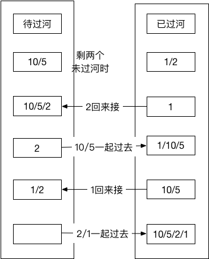

经典过河问题

在一个夜黑风高的晚上，有n（n <= 50）个小朋友在桥的这边，现在他们需要过桥，但是由于桥很窄，每次只允许不大于两人通过，他们只有一个手电筒，所以每次过桥的两个人需要把手电筒带回来，i号小朋友过桥的时间为T[i]，两个人过桥的总时间为二者中时间长者。问所有小朋友过桥的总时间最短是多少。

思路
=
经典的暗夜过河问题，网上大部分解法，只谈了解法，没有说明具体原因，以及解题的思路。

本题思路有一个很简单的想法，河这边剩余XX个人时，怎么办。

分两步走：

一、河这边还剩一个人时，
$$\begin{aligned}opt[i] & = a[i] + a[1] + opt[i-1]\end{aligned} \\\\ 当前+那边过来接+前i-1个$$

二、河这边还剩两个人时，
$$opt[i] = a[2] + a[i] + a[1] + a[2] + opt[i-2] \\\\ 过来接+最后两个一起走+a 1/2 一起过去 + 前面i-2个$$
参考以下图片  

那么最后我们可以比较两个方式，取其中较小的，即可。
