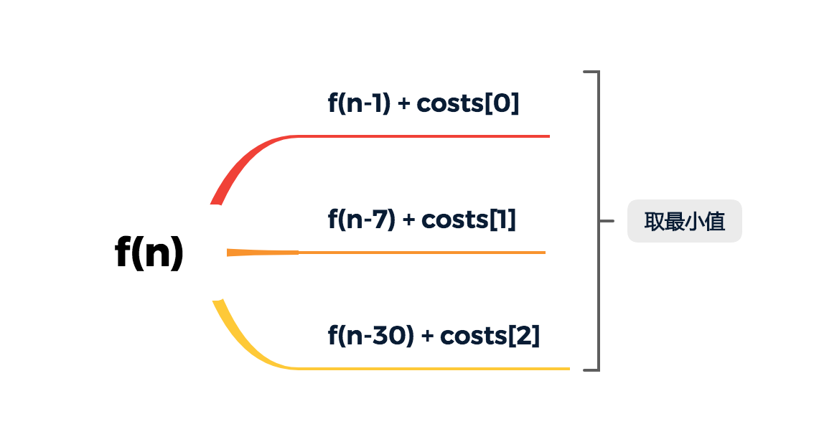

在一个火车旅行很受欢迎的国度，你提前一年计划了一些火车旅行。在接下来的一年里，你要旅行的日子将以一个名为 days 的数组给出。每一项是一个从 1 到 365 的整数。

火车票有三种不同的销售方式：

一张为期一天的通行证售价为 `costs[0]` 美元；
一张为期七天的通行证售价为 `costs[1]` 美元；
一张为期三十天的通行证售价为 `costs[2]` 美元。
通行证允许数天无限制的旅行。 例如，如果我们在第 2 天获得一张为期 7 天的通行证，那么我们可以连着旅行 7 天：第 2 天、第 3 天、第 4 天、第 5 天、第 6 天、第 7 天和第 8 天。

返回你想要完成在给定的列表 days 中列出的每一天的旅行所需要的最低消费。

 

示例 1：
```
输入：days = [1,4,6,7,8,20], costs = [2,7,15]
输出：11
解释： 
例如，这里有一种购买通行证的方法，可以让你完成你的旅行计划：
在第 1 天，你花了 costs[0] = $2 买了一张为期 1 天的通行证，它将在第 1 天生效。
在第 3 天，你花了 costs[1] = $7 买了一张为期 7 天的通行证，它将在第 3, 4, ..., 9 天生效。
在第 20 天，你花了 costs[0] = $2 买了一张为期 1 天的通行证，它将在第 20 天生效。
你总共花了 $11，并完成了你计划的每一天旅行。
```
示例 2：
```
输入：days = [1,2,3,4,5,6,7,8,9,10,30,31], costs = [2,7,15]
输出：17
解释：
例如，这里有一种购买通行证的方法，可以让你完成你的旅行计划： 
在第 1 天，你花了 costs[2] = $15 买了一张为期 30 天的通行证，它将在第 1, 2, ..., 30 天生效。
在第 31 天，你花了 costs[0] = $2 买了一张为期 1 天的通行证，它将在第 31 天生效。 
你总共花了 $17，并完成了你计划的每一天旅行。
```
 

提示：

* `1 <= days.length <= 365`
* `1 <= days[i] <= 365`
* days 按顺序严格递增
* `costs.length == 3`
* `1 <= costs[i] <= 1000`
通过次数6,148提交次数10,629

来源：力扣（LeetCode）
链接：https://leetcode-cn.com/problems/minimum-cost-for-tickets
著作权归领扣网络所有。商业转载请联系官方授权，非商业转载请注明出处。

解题
=
本题，看到这个描述，大致就可以确定是使用动态规划的方式去实现，一步步向后移动。

但是这里有一个需要注意的地方，也就是要把原始的天数，转换成按天来，也就是实现中的 dp 的长度为 `days[days.length - 1] + 1`，这样的话，我们可以一直使用。
那么，我们只需要取三个值的最小值即可


总结
=
动态规划是解决此类问题的最优解，动态规划基本思想就是由小及大，先解决子问题，再根据已有的子问题的，包装成大的解决方案。